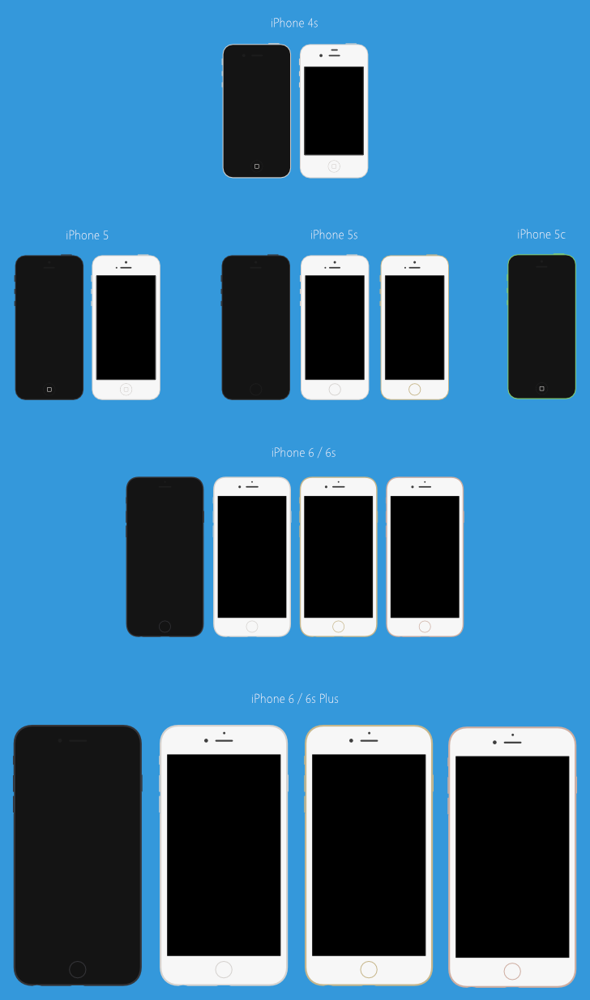
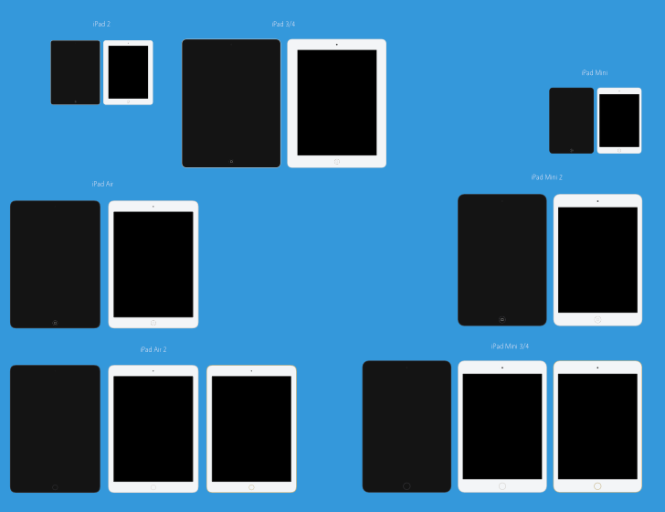

# Pomme Plate 

_Pomme Plate_ is a collection of flat mockups you can use, remix, transform and share. _Pomme plate_ means "flat apple" in French.

## Overview
All mockups are available in SVG, PNG and as Affinity Designer project files. Sketch project files are coming soon!

I am not a designer. Although I find a certain harmony between the color I've chosen, your sharp, educated eye might tell you otherwise.

You can tweak the colors if necessary.

### iPhone ###

**Note:**
> iPhone 6 Plus and iPhone 6s Plus appear much bigger than they should be. That's because they have a 2208×1242 viewport downsampled to 1920×1080. Keeping the original screen resolution allows you to add screenshots; you'll then need to reduce the size of the whole thing (mockup + screenshot) by about 13.1%.

More Apple devices are on the way!

### iPad ###

**Note:**
> Once again, device sizes are depending on their resolution rather than their physical size. The iPad Mini is about 15.3% smaller than the iPad Air. The screen size of an iPad 3/4 is the same as the screen size of an iPad Air (2). Non retina devices are 50% smaller.

More Apple devices are on the way!

## License
_Pomme Plate_ is licensed under a [CC0 1.0 Universal License](http://creativecommons.org/publicdomain/zero/1.0/)

To the extent possible under law, I ([Frédéric Maquin](http://ephread.com)) have waived all copyright and related or neighboring rights to _Pomme Plate_.